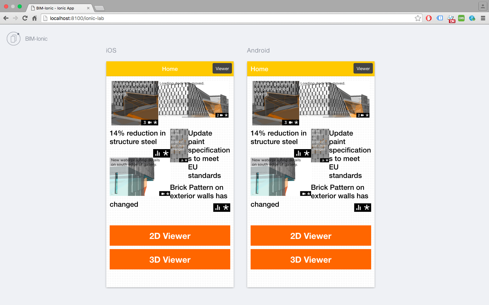
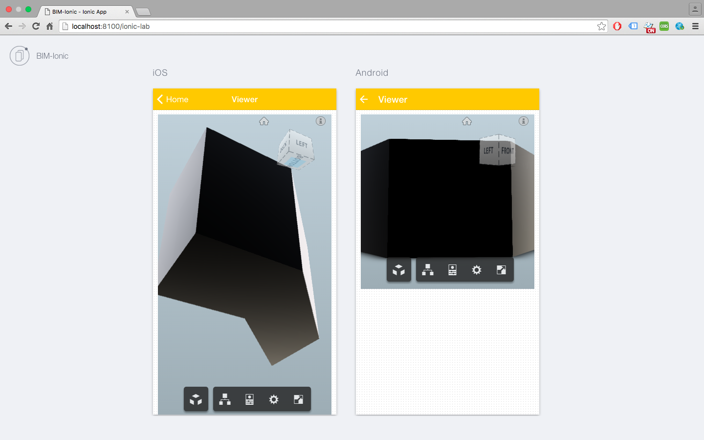

# Ionic-3D-App

This app is created by using ionic framework which supports
iOS and Andriod. I embedded 3D viewer in the app by using
Autodesk api's.

How to create account and how to create personal app is explained in detail
on Autodesk website:

https://developer.autodesk.com/api/view-and-data-api/

This app is running on my credentials. Please replace with your credentials for testing.

## Build

npm install  

bower install

ionic serve to test on browser

ionic emulate iOS to test on ios emulator

# How to use

App will launch home view. By clicking on viewer button will go to detail view.
I used simple file in web viewer. This app allows to test big building models.

## Result

 

